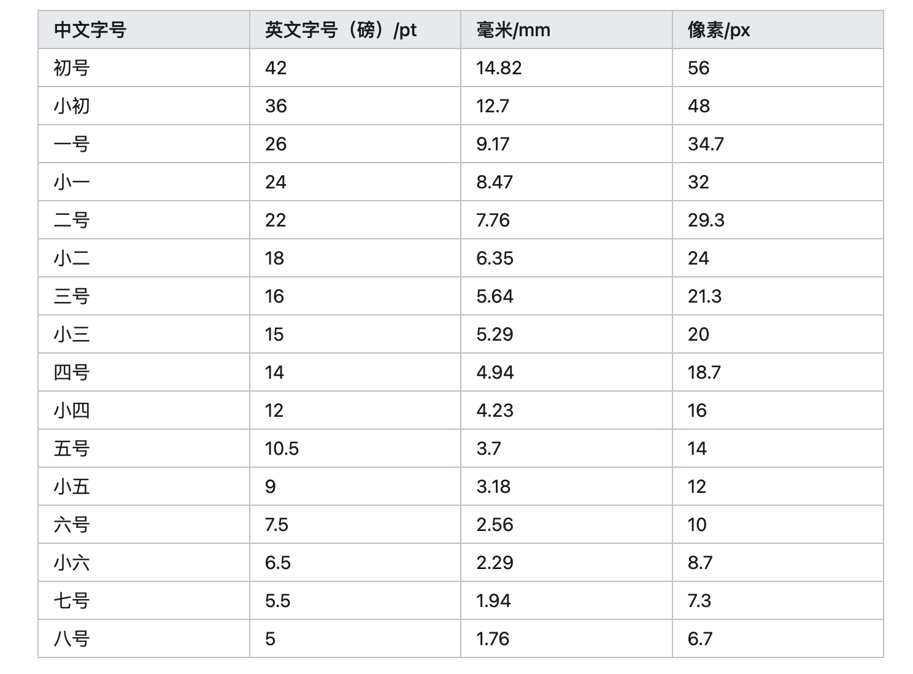

# 常用工具包
## version 1.4.4
### updates
1. 更新`common_utils.haier.auto_test.parse_log`模块
   + 新增`get_do_nlp_analysis_info_from_log`功能，解析得到nlp的最终输出结果，给到云端
   + 新增`get_device_lst(sn, env="test", by_type=True)`功能，获取用户的设备列表信息
2. 更新`common_utils.haier.auto_deploy.xuanwu`模块
   + 新增`add_intent_into_xuanwu(domain, intent, intent_name)`功能，插入新意图
   + 新增`add_slot_into_xuanwu(self, domain, intent, slot_info_lst)`功能，插入新槽位
   + 新增`remove_slot_from_xuanwu(self, domain, intent, slots_to_remove)`功能，删除槽位
   + 新增`edit_template(self, domain, intent, old_template, new_template)`功能，编辑已有模板

## version 1.4.3
### updates
1. 在`common_utils.const.web`模块中新增玄武平台的验收环境cookie
2. 更新`common_utils.haier.auto_test.parse_log`模块
   + 解析日志时，默认过滤不必要的BlockTemplate等semantics
   + rm_block_semantics时，默认不删除BlockNLU语义信息 
   + 新增rm_block_template, rm_block_nlu, rm_block_corpus等功能，单独处理各种不必要的阻塞意图
3. 新增`common_utils.haier.auto_deploy.xuanwu`模块，支持
   + 自动增加模板
   + 开发、验收及仿真环境自动部署
   + 验收环境数据更新下载
   + 领域同步到仿真
   + 数据导入到验收环境

## version 1.4.2
### updates
1. 新增`common_utils.haier.xuanwu.dict_op`模块：
   + 支持玄武字典的查询`get_word_dict_in_xuanwu(dict_code)`
   + 支持向玄武字典中添加词语`add_word_to_xuanwu_dict(dict_code, word, synonym="")`
   + 支持搜索玄武字典中的词语`search_word_in_xuanwu_dict(dict_code, word)`
   + 支持编辑玄武字典中词语的同义词`edit_xuanwu_dict(dict_code, word, synonym)`
   + 支持向玄武系统中新增字典`add_word_dict_in_xuanwu(dict_code, dict_name, parent_code=0, dict_type="ENUM", dict_category="OTHER")`
2. 更新获取query信息的方法
3. 新增获取云端设备执行结果信息（nlpResult）的方法
   + `get_device_exec_result(sn, env="test", verbose=True)`
4. 新增加载模拟设备列表功能
   + `load_simulation_devices(sim_device_path=None)`


## version 1.4.1
### updates
1. 新增common_utils.const.web模块：
   + 包括`USER_AGENT`，即请求头中的用户代理
2. 新增common_utils.convert.tts模块：
   + TTS功能`youdao_english_tts(sentence, save_path=None)`，通过调用youdao api，将英文文本转换成mp3
3. 更新common_utils.haier.auto_test.parse_log模块：
   + 使用签名计算，实现海尔生产环境的日志解析
   + 签名算法为hashlib.sha256，计算内容为url的base部分，常量和时间戳
4. 新增common_utils.algorithm.josephus模块：
   + 算法`josephus(m, k)`，用于实现约瑟夫环问题，其中m为人数，k为最大报数

## version 1.4.0
### updates
1. 新增**common_utils.text_io.word**模块
   + 支持docx文档的读写操作
   + 支持插入图片
   + 支持读写表格数据, `insert_table(data_lst)`, `extract_table(table_idx)`
   + 支持格式化文本，如字体设置`set_font(run, **args)`等
   + 支持页面设置，`set_page(margin=(3.18, 3.18, 2.54, 2.54), column=1, column_space=0.5)`
   + 支持插入新页面，`add_new_page()`
   + 等等

2. 新增**common_utils.poetry.poetry**模块，用于古诗文处理
   + 继承`common_utils.text_io.word.Docx`
   + 支持添加古诗标题，`add_poetry_title(title)`
   + 支持添加古诗作者，`add_poetry_author(author)`
   + 支持添加古诗正文，`add_poetry_content(content)`
   + 支持添加古诗学习日期，`add_poetry_date(date)`
   + 支持添加整首古诗信息，`add_poetry(poetry_info: dict)`
   + 等等

3. 字体大小对照表


4. **common_utils.pdf.create_pdf**模块中新增功能
   + 新增画线功能`draw_line(**kwargs)`, 支持`color`, `width`, `rect`, `x1, y1, x2, y2`, `dashed`设置
     + `color`为RGB的tuple类型
     + `width`为float类型
     + `rect`为线条位置，无此字段时，可取`x1, y1, x2, y2`
     + `dashed`为bool类型, default为False, 即实线
   + 新增画框功能`draw_rect(**kwargs)`, 支持`color`, `width`, `rect`, `style`设置，同上
   + 新增画汉字田字格功能`draw_char_cell(self, x0, y0, cell_size=41, color=(0, 150, 0))`
     + `(x0, y0)`为田字格的左上角位置坐标
     + `cell_size`为田字格大小，default为41磅
     + `color`为田字格颜色，default为(0, 150, 0)，为墨绿色
   + 新增画拼音格功能`draw_pinyin_cell(self, x0, y0, height=18, width=41, color=(0, 150, 0))`
     + `(x0, y0)`为拼音格的左下角位置坐标，和下面对应的田字格坐标相同
     + `height`为拼音格高度，default为18磅
     + `width`为拼音格宽度，default为41磅，和田字格cell_size相同
     + `color`为拼音格颜色，default为(0, 150, 0)，为墨绿色
   + 新增画拼音+田字格页面功能`draw_char_pinyin_page(self, x0=46, y0=106, char_cell_size=41, pinyin_height=18, row_num=8, col_num=12)`
     + `(x0, y0)`为田字格左上角起始位置
     + `char_cell_size`为田字格大小，default为41磅
     + `pinyin_height`为为拼音格高度，default为18磅
     + `row_num`为田字格的列数，default为12
     + `col_num`为田字格的行数，default为8
   + 新增写入汉字及拼音内容`add_content(self, text_info)`
     + `text_info`: 待写入的文本信息，包含`text, pos, font, color, size`等字段
     + 输入示例：
          ```json
       {
              "text": "初",
              "pinyin": "chū",
              "pos": [215, 104, 245, 147],
              "font": "华文楷体",
              "color": [135, 135, 135],
              "size": 30
          }
       ```
5. **common_utils.pdf.create_pdf**模块中，新增PDF子类`MathQuestionPDF`

6. common_utils.pdf中新增枚举类型的颜色类color_v2.Color，主要包括常用颜色的RGB值
## version 1.3.2
### updates
1. 新增**common_utils.ner.convert**模块，用于格式化NER任务数据
   
2. 在已有模块**common_utils.text_io.txt**中，新增save_to_txt方法，用于保存list数据
   + 支持保存列表数据到文本文件，如.txt, .tsv等
   + 支持数据末尾自动添加必要的换行符

## version 1.3.1
### updates
1. 新增**common_utils.web.parser**模块，用于web网页的操作
   + 支持文件资源的下载（支持代理设置），download_file
   + 支持网页下载，download_web
   + 支持根据文本内容text查找相关网页元素，get_item_by_text，返回所有相关元素列表
   + 支持根据网页元素抽取相关链接，get_related_links(item, depth=5)，支持深度设置，默认为5
   + 支持根据相关链接抽取对应的\<a\>元素，get_item_by_href(href)
   + 支持根据元素属性抽取所有的链接，get_links_by_attr(**attr)
2. 新增**pdf.read_pdf**模块， 
   + 支持从pdf文件（主要是arxiv论文）中抽取正文
   + 支持正文内容的预处理，如“合并合成词”，“过滤参考文献标记”等

## version 1.3.0
### updates
1. 新增common_utils.pdf.create_pdf模块，用于创建并写入pdf文档
   + 支持header和footer设置
   + 支持页边距和页面行数设置
2. common_utils/pdf/fonts目录中增加华文字体， 用于支持中文字符写入pdf文档


## version 1.2.9 
### updates
1. 新增common_utils.convert.translation模块，用于处理翻译任务
  + 目前可支持google翻译和有道翻译

**注意**:
1. google翻译需要梯子才能使用
2. 有道翻译(v3)需要设置Cookie，或者使用AES解密方法(v4已实现)
3. 需要安装pycryptodome>=3.18.0用于AES解密


...


## version 1.2

1. 新增haier自动测试功能
  + nlu模块，用于自动化测试use cases
  + parse_log模块，用于日志信息解析，加速问题分析和定位
